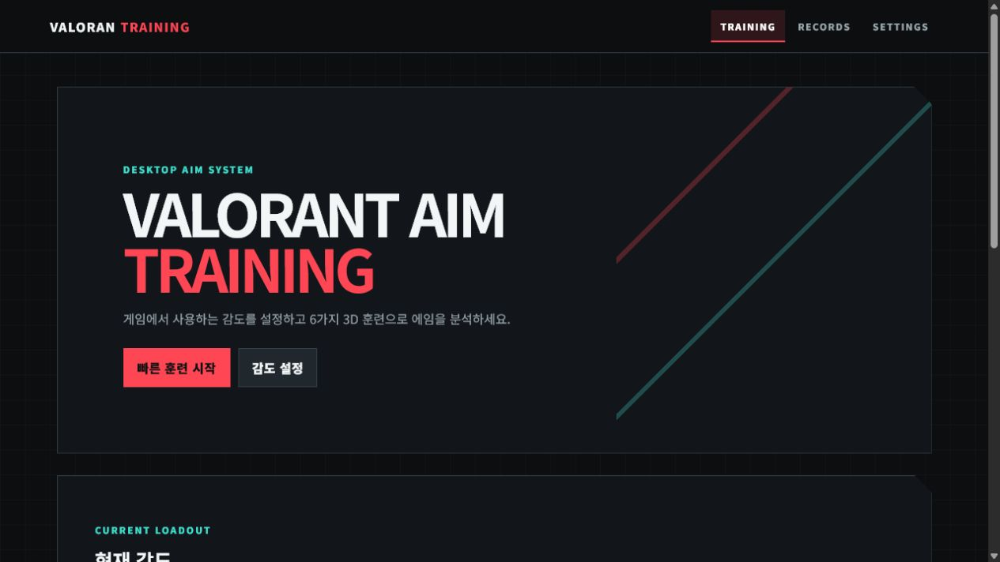
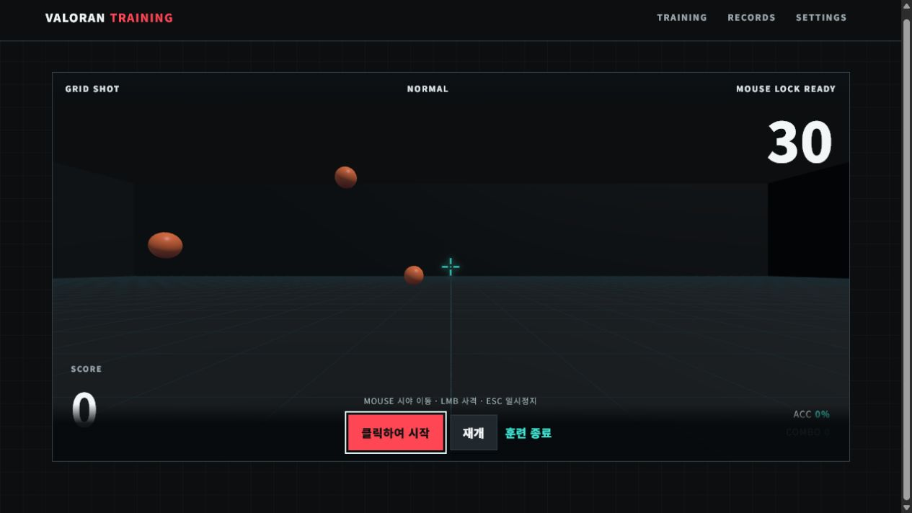

# VALORAN TRAINING

> VALORANT 감도를 기준으로, 브라우저에서 바로 시작하는 3D 에임 훈련

[**훈련 시작하기**](https://valoran-training.peter2385.chatgpt.site)

## 이렇게 시작하세요

1. **감도 입력** — 마우스 소프트웨어에 설정된 실제 DPI와 VALORANT 인게임 감도를 입력합니다.
2. **크로스헤어 설정** — 색상, 선 길이, 굵기, 중앙 간격, 센터 도트를 원하는 형태로 맞춥니다.
3. **훈련 선택** — 모드와 난이도, 30초 또는 60초 훈련 시간을 선택한 뒤 시작합니다.

## 실제 훈련 화면

마우스로 시야를 움직이고 왼쪽 클릭으로 표적에 반응하세요. `Esc`를 누르면 훈련을 일시정지할 수 있습니다.

## 6가지 훈련 모드

| 모드 | 이런 훈련에 좋아요 |
| --- | --- |
| **GRID SHOT** | 넓은 각도의 플릭과 빠른 표적 선택 |
| **MICRO FLICK** | 짧은 거리에서의 미세 조준 수정 |
| **REACTION SHOT** | 표적을 보고 첫 클릭을 하기까지의 반응 |
| **TARGET SWITCHING** | 여러 표적 사이를 빠르게 전환하는 능력 |
| **STRAFE TRACK** | 움직이는 표적을 따라가는 추적 능력 |
| **HEADSHOT ONLY** | 머리 표적을 정확하게 맞히는 연습 |

모든 모드는 **Easy / Normal / Hard** 난이도를 제공하며, 난이도에 따라 표적 크기·거리·이동·노출 시간이 달라집니다.

## 감도와 DPI 안내

- DPI에는 **현재 마우스 소프트웨어에 설정된 실제 값**을 입력하세요.
- 이 입력값을 바꿔도 브라우저나 마우스의 하드웨어 DPI가 변경되지는 않습니다.
- 입력한 DPI는 eDPI와 VALORANT 360° 거리 계산에 사용됩니다.
- 게임과 가장 비슷하게 사용하려면 VALORANT에서 쓰는 감도와 실제 DPI를 그대로 입력하세요.

## 사용 환경과 조작

- Windows 데스크톱 Chrome과 물리 마우스 환경을 권장합니다.
- WebGL과 Pointer Lock을 사용하므로, 훈련 시작 시 화면 클릭으로 마우스 잠금을 허용해야 합니다.
- 시야 이동: 마우스 · 사격: 왼쪽 클릭 · 일시정지: `Esc`

## 안내

## Google 로그인과 랭킹 설정

훈련은 로그인 없이 바로 시작할 수 있습니다. Google 로그인은 기록을 온라인에
저장하고 공개 랭킹에 참여할 때만 사용합니다. 비밀번호는 이 서비스에 저장하지
않습니다.

운영 환경에서는 .env.example을 복사해 다음의 공개 브라우저 값만 설정하세요.
서비스 역할 키나 데이터베이스 비밀번호는 절대 클라이언트 코드나 Sites 배포물에
넣으면 안 됩니다.

~~~bash
VITE_SUPABASE_URL=https://your-project-ref.supabase.co
VITE_SUPABASE_PUBLISHABLE_KEY=sb_publishable_your_public_key
~~~

Supabase에서 supabase/migrations/20260723000000_accounts_and_ranking.sql
마이그레이션을 적용한 뒤, Google 제공자를 활성화하고 다음 리디렉션 주소를
등록해야 합니다.

- 개발: http://localhost:5173/
- 운영: https://valoran-training.peter2385.chatgpt.site/

랭킹에는 닉네임, 점수, 모드·난이도·훈련 시간, 완료 일자만 노출됩니다. 원본
훈련 통계와 이메일은 본인 계정만 읽을 수 있도록 데이터베이스 권한으로 제한합니다.

Valoran Training은 비공식 팬 제작 연습 도구입니다. Riot Games 또는 VALORANT와 제휴하거나 승인받지 않았으며, Riot의 로고·맵·에이전트·UI·봇·사운드 자산을 사용하지 않습니다.
